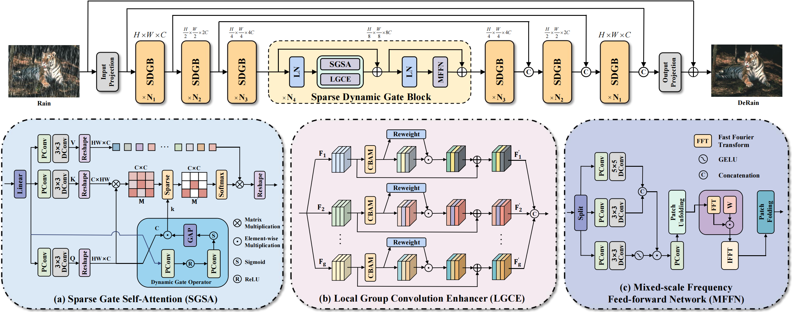
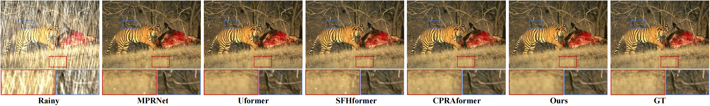
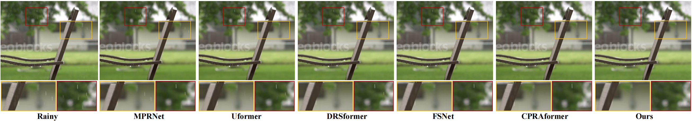
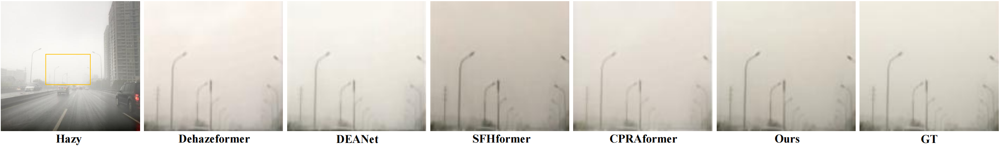
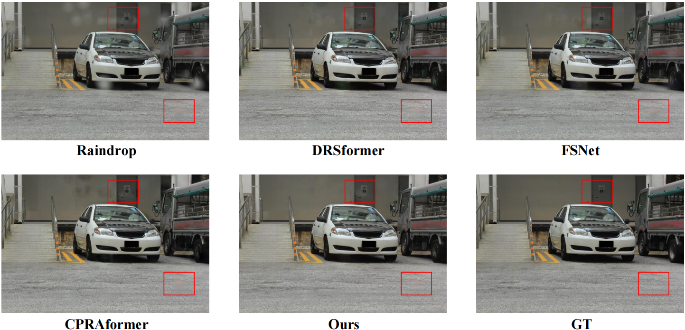

# [ICME 2026] Learning Where to Attend: A Sparse Dynamic Gate Transformer for Efficient Image Deraining
---

> **Abstract:** Image deraining aims to reconstruct high-quality scenes from degradations caused by rain streaks and raindrops. Although recent Transformers enhance long-range modeling, they rely on inefficient attention (dense or fixed sparse), wasting computation on rain-irrelevant regions and introducing noisy interactions. To address these issues, we propose a Sparse Dynamic Gate Transformer (SDGformer), which learns where to attend by coupling content-adaptive sparse attention with local structure refinement. Specifically, a Dynamic Gate Operator (DGO) predicts input-dependent attention sparsity and scope, allocating computation to rain-degraded regions on demand. Built on DGO, Sparse Gate Self-Attention (SGSA) captures global dependencies with dynamic sparsity, while a parallel Local Group Convolution Enhancer (LGCE) sharpens edges and textures by reweighting local feature groups. Moreover, a Mixed-scale Frequency Feed-forward Network (MFFN) integrates multi-scale spatial features with complementary frequency cues to restore fine details. Extensive experiments demonstrate that SDGformer achieves state-of-the-art performance on eight benchmark datasets and generalizes well to other image restoration tasks.

---
<details>
<summary>Overall Framework (click to expand)</summary>

- Overall Framework

<p align="center">
  
</p>
<details>


## ⚙️ Dependencies

- OS: Linux / Windows
- Python: 3.8
- CUDA: 11.8 (recommended)
- GPU: NVIDIA 4090 GPU 

```bash
# Clone and enter project
git clone https://github.com/zhn0504/SDGformer.git
cd SDGformer

# Create and activate conda environment
conda create -n SDGformer python=3.8 -y
conda activate SDGformer

# Upgrade pip
python -m pip install --upgrade pip

# Install PyTorch (CUDA 11.8)
pip install torch torchvision torchaudio --index-url https://download.pytorch.org/whl/cu118

# Install other Python dependencies
pip install matplotlib scikit-image opencv-python yacs joblib natsort h5py tqdm
pip install tensorboard einops numpy
```

Install warmup scheduler:

```bash
cd pytorch-gradual-warmup-lr
python setup.py install
cd ..
```

---

## <a name="datasets"></a>🖨️ Datasets

Used training and testing sets can be downloaded as follows:


Rain Streaks

<table>
  <thead>
    <tr>
      <th><div align="center">Training Set</div></th>
      <th><div align="center">Testing Set</div></th>
    </tr>
  </thead>
  <tbody>
    <tr>
      <td>
        <div align="center"><strong>Rain13K</strong></div>
        <div align="left">
          Complete training dataset:
          <a href="https://drive.google.com/drive/folders/1Hnnlc5kI0v9_BtfMytC2LR5VpLAFZtVe">Google Drive</a>
          /
          <a href="https://pan.baidu.com/s/1uYgoetlYGK_iOQ4XMbRExw?pwd=wzkw">Baidu Disk</a>
        </div>
      </td>
      <td>
        <div align="center"><strong>Test100 + Rain100H + Rain100L + Test2800 + Test1200</strong></div>
        <div align="left">
          Complete testing dataset:
          <a href="https://drive.google.com/drive/folders/1PDWggNh8ylevFmrjo-JEvlmqsDlWWvZs">Google Drive</a>
          /
          <a href="https://pan.baidu.com/s/1uYgoetlYGK_iOQ4XMbRExw?pwd=wzkw">Baidu Disk</a>
        </div>
      </td>
    </tr>
  </tbody>
</table>


Raindrops
<table>
  <thead>
    <tr>
      <th><div align="center">Training Set</div></th>
      <th><div align="center">Testing Set</div></th>
    </tr>
  </thead>
  <tbody>
    <tr>
      <td>
        <div align="center"><strong>Train</strong></div>
        <div align="left">
          Complete training dataset:
          <a href="https://drive.google.com/drive/folders/1e7R76s6vwUJxILOcAsthgDLPSnOrQ49K">Google Drive</a>
        </div>
      </td>
      <td>
        <div align="center"><strong>Test a/b</strong></div>
        <div align="left">
          Complete testing dataset:
          <a href="https://drive.google.com/drive/folders/1e7R76s6vwUJxILOcAsthgDLPSnOrQ49K">Google Drive</a>
        </div>
      </td>
    </tr>
  </tbody>
</table>


Download training and testing datasets and put them into the corresponding folders of `Datasets/`. See [Datasets](Datasets/README.md) for the detail of the directory structure.

## <a name="training"></a>🔧 Training and Evaluation

 Download [training](https://pan.baidu.com/s/1uYgoetlYGK_iOQ4XMbRExw?pwd=wzkw) (Rain13K) and [testing](https://pan.baidu.com/s/1uYgoetlYGK_iOQ4XMbRExw?pwd=wzkw) (Test100 + Rain100H + Rain100L + Test2800 + Test1200) datasets, place them in `Datasets/`.

 Run the following scripts. The training configuration is in `training.yml`.

  ```shell
  python train.py
  ```

 The training experiment is in `checkpoints/`.


 Download [testing](https://pan.baidu.com/s/1uYgoetlYGK_iOQ4XMbRExw?pwd=wzkw) (Test100 + Rain100H + Rain100L + Test2800 + Test1200) datasets, place them in `Datasets/`.

 Run the following scripts. The testing configuration is in `test.py`.

  ```shell
  python test.py
  ```

 The output is in `results/`.
 To reproduce PSNR/SSIM scores of the paper, run (in matlab):
  ```shell
  evaluate_PSNR_SSIM.m 
  ```

## <a name="results"></a>🔎 Results

Detailed results can be found in the paper.

<details>
<summary>Visual Comparison (click to expand)</summary>

- deraining results in figure 4 of the main paper

<p align="center">
  
</p>

- deraining results in figure 5 of the main paper

<p align="center">
  
</p>


- dehazing results in figure 6 of the main paper

<p align="center">
  
</p>


- deraining results in figure 1 of the supplementary material

<p align="center">
  
</p>


</details>


## <a name="citation"></a>📎 Citation

We kindly request that you cite our work if you utilize the code or reference our findings in your research:
```
@inproceedings{zhao2026sdgformer,
  title={Learning Where to Attend: A Sparse Dynamic Gate Transformer for Efficient Image Deraining},
  author={Zhao, Haonan and Pan, Weifeng and Xie, Ruiyu and Qiu, Zirui and Ma, Yifan and Luo, Ruikang},
  booktitle={ICME},
  year={2026}
}
```
## <a name="acknowledgements"></a>💡 Acknowledgements

This code is built on [MPRNet](https://github.com/swz30/MPRNet).
